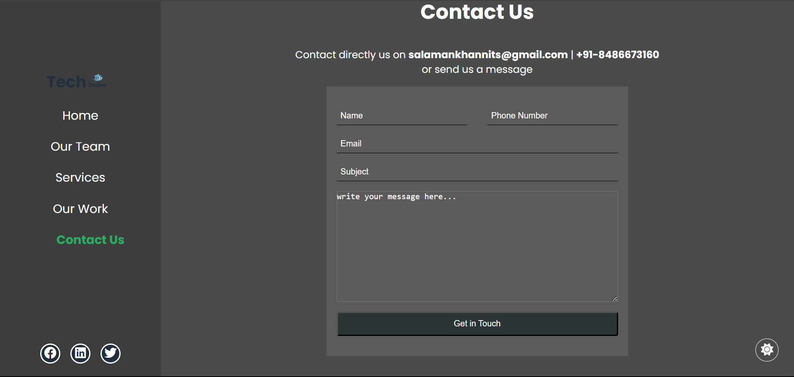

[Live Link](https://techdhara047.github.io/)

# TechDhara
We are a team of web developers dedicated to crafting modern, responsive, and visually appealing websites. Specializing in custom solutions, we tailor each project to meet the unique needs of our clients. Whether you're a small business or a growing brand, we're here to help you build a strong online presence with user-friendly designs and cutting-edge technology.

## About us


## Our Team


## Services


## Our work


## contact us


## Tech Stack
- Astro
- CSS
- JavaScript


## How to use

1. Clone the repo

```bash
git clone https://github.com/techdhara047
```

2. Install dependencies

```bash
npm install
```

3. Start the dev server

```bash
npm run dev
```

## Contributing

Pull requests are welcome. For major changes, please open an issue first to discuss what you would like to change.

## License

This project is open source and available under the [MIT License](LICENSE).